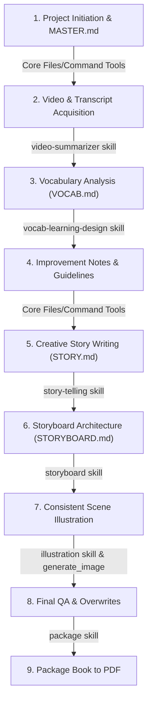

# Project Workflow & Used Skills

This document traces the complete workflow of the pilot project from inception to its current state, detailing the specific AI agent skills applied at each step.

---

## Workflow Diagram

---

## Detailed Workflow Steps

### Step 1: Project Setup & Master Plan Initiation
*   **Goal**: Establish a central hub to manage tasks and track progress.
*   **Actions**:
    *   Created the pilot project structure.
    *   Initialized [MASTER.md](../MASTER.md) detailing project scopes, outlines, and task checkboxes.
*   **Skills Used**: *Core File & Command Tools*.

### Step 2: Video & Transcript Acquisition
*   **Goal**: Download the target children's song and extract its plain-text lyrics.
*   **Actions**:
    *   Downloaded video and extracted high-quality audio files from the YouTube link.
    *   Downloaded raw VTT subtitles and converted them into clean text formats ([transcript.txt](../song/transcript.txt) and [summary.md](../song/summary.md)).
    *   Cleaned transcript to remove sound-effects and speaker descriptors (e.g., `(gentle music)`, `[Narrator]`).
*   **Skills Used**: **video-summarizer** skill.

### Step 3: Vocabulary Analysis & Learning Design
*   **Goal**: Extract learning-valuable vocabulary from the song.
*   **Actions**:
    *   Analyzed the transcript to extract 10 core content words.
    *   Generated [VOCAB.md](../vocab/VOCAB.md), classifying terms into tier structures (Tier 1 vs. Tier 2/3), parts of speech, IPA phonetic symbols, contextual definitions, and priority categories.
*   **Skills Used**: **vocab-learning-design** skill.

### Step 4: Guideline Documentation (Improvements)
*   **Goal**: Document parsing lessons and project architecture policies.
*   **Actions**:
    *   Created [improvements/skill_vocab_learning/NOTE.md](../improvements/skill_vocab_learning/NOTE.md) to log guidelines for stripping annotations wrapped in `()` or `[]`.
    *   Created [improvements/md_agents/NOTE.md](../improvements/md_agents/NOTE.md) enforcing a project-wide rule to use relative paths for linking Markdown files to keep the repository portable.
*   **Skills Used**: *Core File & Command Tools*.

### Step 5: Narrative Story Writing
*   **Goal**: Translate the short song lyrics into a structured narrative for children.
*   **Actions**:
    *   Authored the picture book story *Shhh... Woof!* inside [story/STORY.md](../story/STORY.md), targeted specifically for Ages 2–5.
    *   Audited the prose using the **"Is/Are/Was" scan** to replace static copula verbs with visual showing actions (e.g., replacing *"It is a quiet cat"* with *"A quiet cat stretches its pink paws"*).
*   **Skills Used**: **story-telling** skill.

### Step 6: Storyboard Architecture & Beat Mapping
*   **Goal**: Layout a page-by-page visual blueprint for printing.
*   **Actions**:
    *   Mapped the story into 5 double-page spreads using the Quarter-Half-Quarter pacing rule.
    *   Generated [storyboard/STORYBOARD.md](../storyboard/STORYBOARD.md) detailing camera composition angles, gutter safety audits, visual flow directions, character consistency anchors, and page-turn hooks.
*   **Skills Used**: **storyboard** skill.

### Step 7: Consistent Scene Illustration
*   **Goal**: Bring the storyboard to life with painterly illustrations.
*   **Actions**:
    *   Generated the Spread 1 artwork using a volumetric lighting rendering prompt structure.
    *   Extracted the dominant style elements and colors into [visual_specification.md](../illustration/visual_specification.md) to serve as a visual anchor.
    *   Generated illustrations for all 5 spreads sequentially, saving them in the [painterly/](../illustration/painterly/) folder.
    *   Performed an adjustment/overwrite to correct a narrative error in Scene 1 (removing a premature toy mouse in [scene1_cat.png](../illustration/painterly/scene1_cat.png) to maintain chronological consistency).
*   **Skills Used**: **illustration** skill (with the `generate_image` tool).

### Step 8: PDF Book Packaging
*   **Goal**: Package the compiled illustrations into a single portable PDF document.
*   **Actions**:
    *   Authored the [generate_pdf.py](../scripts/generate_pdf.py) packaging script to automate image loading and lossless compilation using the `img2pdf` library.
    *   Refactored the packaging workflow into a project-level reusable skill: **package** ([SKILL.md](../../../.agent/skills/package/SKILL.md)).
    *   Generated the final compiled book file [shhh_woof.pdf](../output/shhh_woof.pdf).
*   **Skills Used**: **package** skill.
